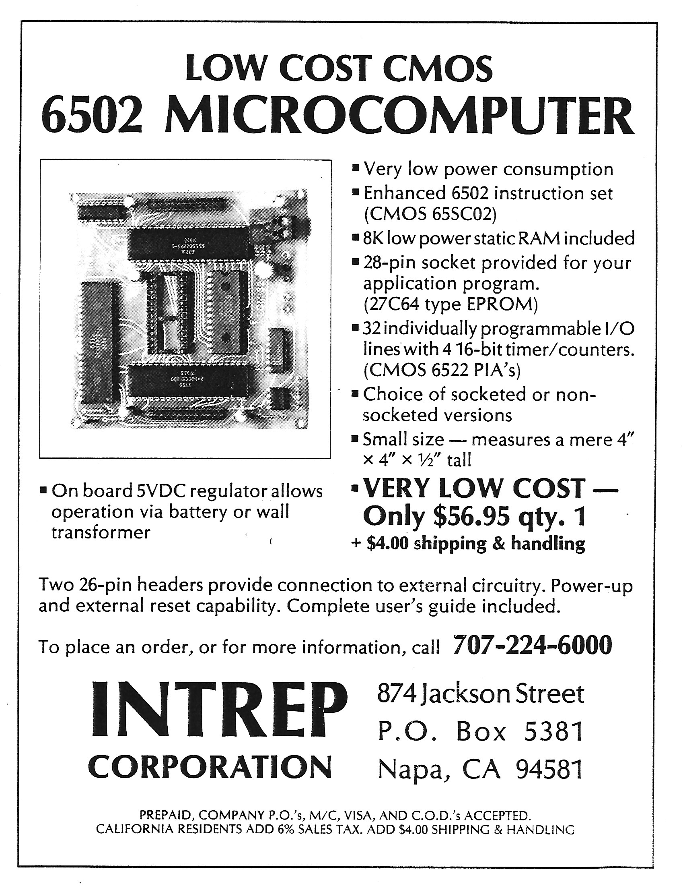

# LCM-32
The LCM-32 is a low cost CMOS 6502 Microcontroller created in 1986 by Matt Gilliland and Carl Edwards.

## Brochure

## PC Board
### Top View

### Bottom View

## Publications
[1987 Byte Magazine](marketing/1987_03_BYTE_12-03_Educational_Computing_p40.pdf)